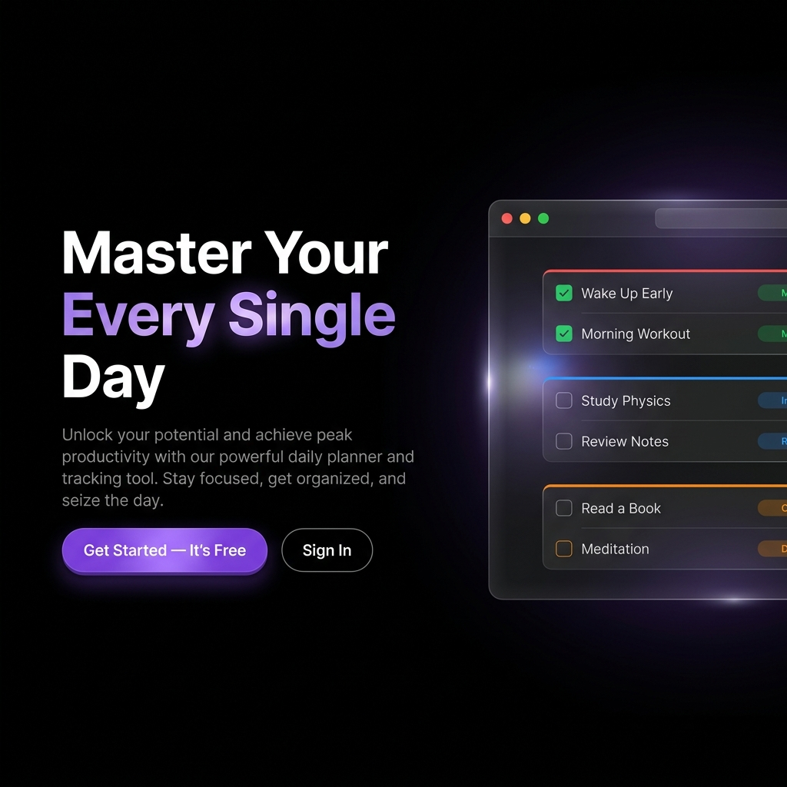
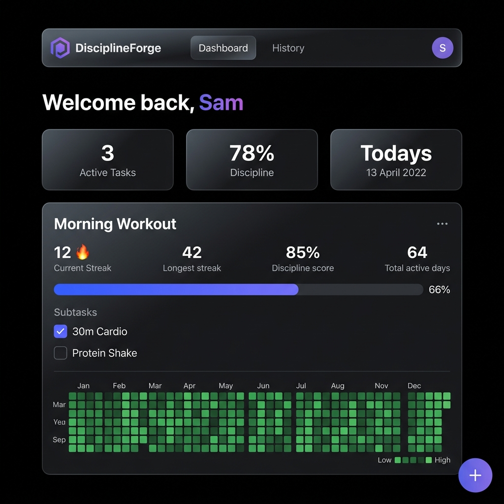
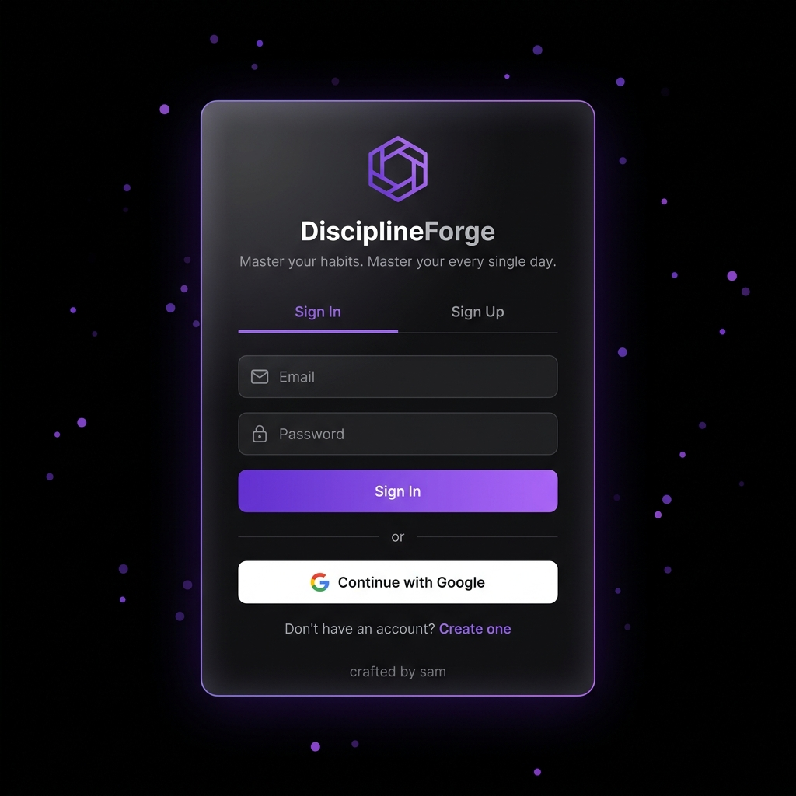
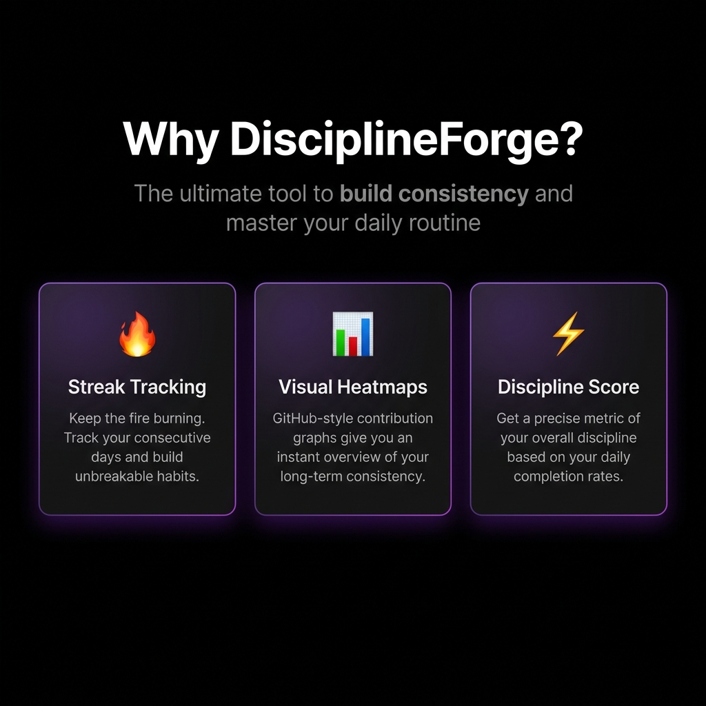
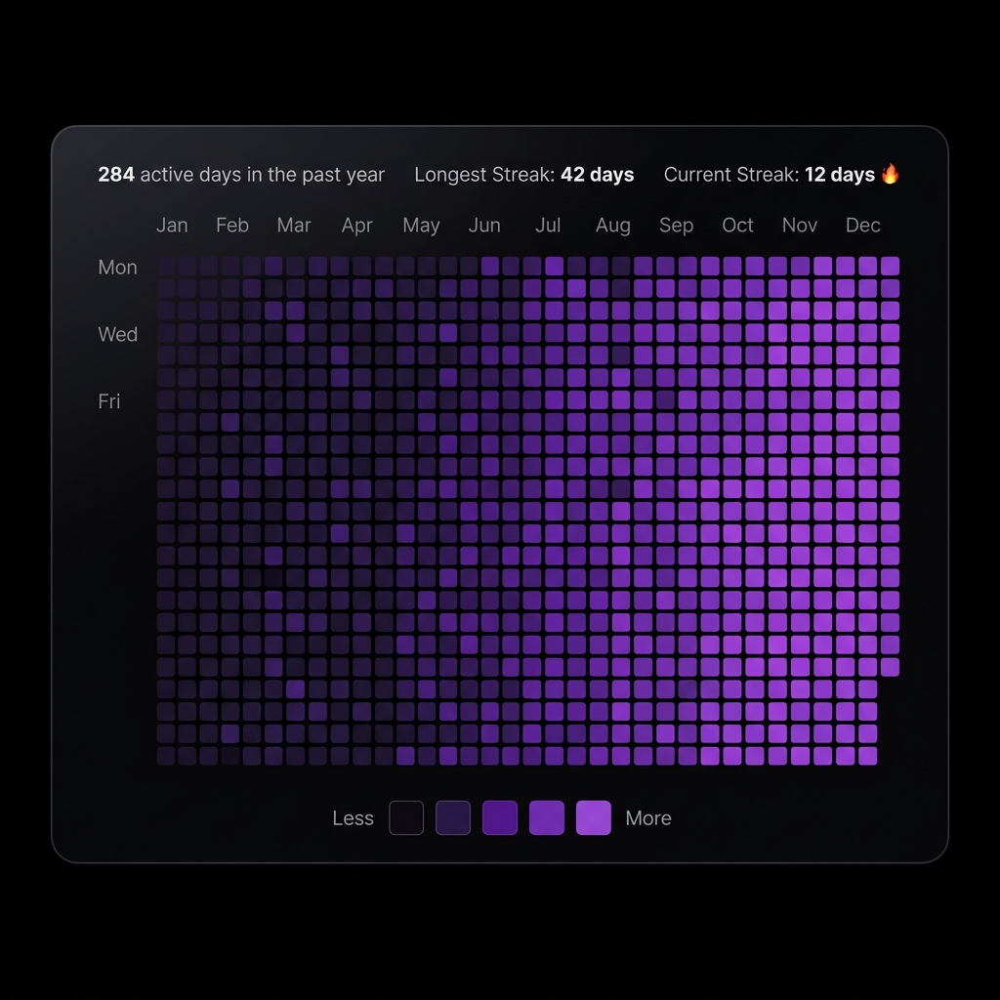
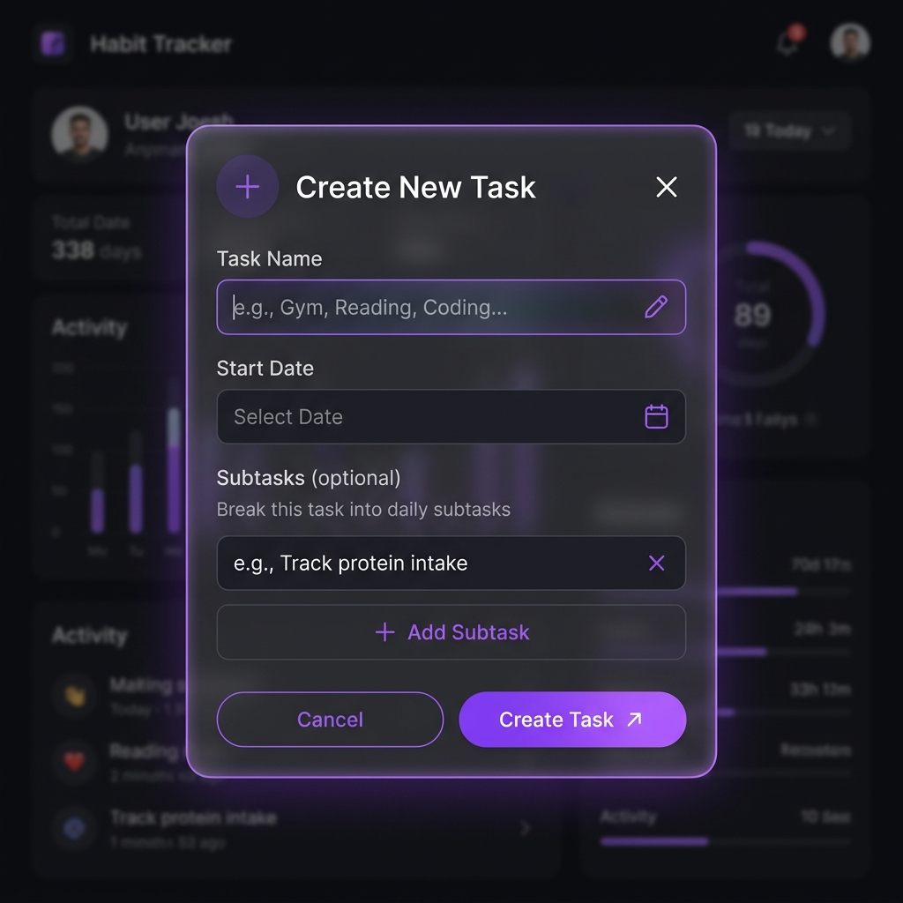
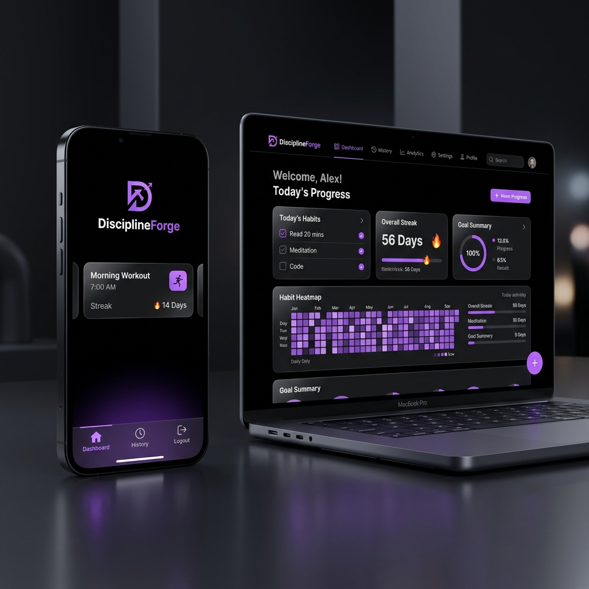
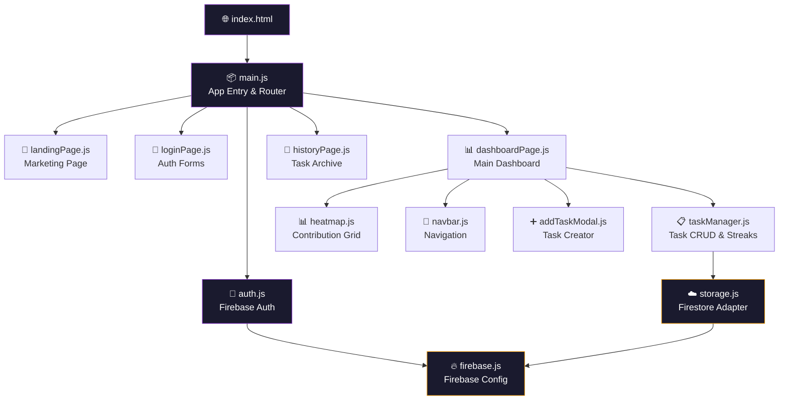

<div align="center">

<!-- Animated Header Banner -->


<br />

<!-- Badges Row 1 -->


<br /><br />

<!-- Badges Row 2 — Tech Stack -->


<br /><br />

<!-- CTA Button -->
<a href="https://staydiscipline.vercel.app/">
  
</a>

<br /><br />

<p><i>"Discipline is the bridge between goals and accomplishment."</i></p>

</div>

---

<br />

## 🎬 Visual Tour

> **Experience DisciplineForge before you even sign up.** Every pixel has been crafted to inspire discipline.

<br />

<div align="center">

### 🏠 Landing Page — First Impressions Matter



<br />

<details>
<summary><b>✨ What you're seeing</b></summary>
<br />

| Element | Description |
|---|---|
| **Hero Headline** | "Master Your Every Single Day" — gradient purple text that commands attention |
| **Dashboard Mockup** | A floating macOS-style window previewing the actual task tracker interface |
| **CTA Buttons** | Primary gradient "Get Started" + secondary glass-morphism "Sign In" |
| **Heatmap Preview** | A live GitHub-style contribution heatmap rendering 364 cells of mock data |
| **Particles Background** | 50 animated floating particles creating depth and movement |

</details>

</div>

<br />

---

<br />

<div align="center">

### 📊 Dashboard — Your Command Center



<br />

<details>
<summary><b>🔍 Dashboard Deep Dive</b></summary>
<br />

The dashboard is where the magic happens. Every element is purpose-built:

| Component | What It Does |
|---|---|
| **Welcome Header** | Personalized greeting with your name in gradient purple |
| **Stat Cards** | At-a-glance metrics — Active Tasks, Discipline %, Today's Date |
| **Task Cards** | Each habit gets its own glassmorphism card with streak stats |
| **Progress Bar** | Color-coded from 🔴 red (0%) → 🟡 yellow → 🔵 blue → 🟣 purple (100%) |
| **Subtask Checkboxes** | Granular daily tracking — check off each sub-goal |
| **Heatmap** | GitHub-style 365-day contribution grid per task |
| **FAB Button** | Floating `+` button to create new tasks instantly |

</details>

</div>

<br />

---

<br />

<div align="center">

### 🔐 Authentication — Secure & Stunning



<br />

<details>
<summary><b>🛡️ Auth Features</b></summary>
<br />

- 🔑 **Email/Password** — Firebase Authentication with real-time validation
- 🔵 **Google OAuth** — One-click sign-in with Google popup
- 🔄 **Tab Switching** — Seamless Sign In ↔ Sign Up toggle animation
- 🎆 **Particle Background** — 50 animated floating purple particles
- 💫 **Glassmorphism Card** — Frosted glass with subtle purple border glow
- ✅ **Success/Error States** — Smooth toast-style feedback animations

</details>

</div>

<br />

---

<br />

<div align="center">

### 🌟 Feature Highlights



</div>

<br />

<table>
  <tr>
    <td width="33%" align="center">
      <h3>🔥 Streak Engine</h3>
      <p>Intelligent streak calculation that works backwards from today. Tracks both <b>current</b> and <b>longest</b> streaks. The fire emoji 🔥 intensifies as your streak grows.</p>
    </td>
    <td width="33%" align="center">
      <h3>📊 GitHub Heatmaps</h3>
      <p>365-day contribution grids — just like GitHub. 5-level purple color scale from dormant to fully active. Per-task heatmaps with month labels, day labels, and hover tooltips.</p>
    </td>
    <td width="33%" align="center">
      <h3>⚡ Discipline Score</h3>
      <p>Your personal discipline metric: <code>(active days ÷ total days) × 100</code>. Tracked per-task and aggregated globally. Watch it climb as your consistency improves.</p>
    </td>
  </tr>
</table>

<br />

---

<br />

<div align="center">

### 📱 Heatmap — Visualize Your Consistency



<br />

<details>
<summary><b>🧬 Heatmap Architecture</b></summary>
<br />

```
┌─────────────────────────────────────────────────────────┐
│  284 active days in the past year    Longest: 42 days   │
│                                      Current: 12 🔥     │
├────┬────────────────────────────────────────────────────┤
│    │ Jan  Feb  Mar  Apr  May  Jun  Jul  Aug  Sep  Oct  │
│Mon │ ░░░▒▒▓▓▓▓██████████████████████████████████       │
│    │ ░░▒▒▒▓▓▓██████████████████████████████████        │
│Wed │ ░░░▒▒▓▓██████████████████████████████████         │
│    │ ░▒▒▒▓▓▓▓██████████████████████████████████        │
│Fri │ ░░▒▒▓▓▓██████████████████████████████████         │
│    │ ░░░▒▒▓▓▓▓█████████████████████████████████        │
│    │ ░▒▒▒▓▓▓██████████████████████████████████         │
├────┴────────────────────────────────────────────────────┤
│  Less  ░  ▒  ▓  █  ██  More                            │
└─────────────────────────────────────────────────────────┘
```

**5-Level Color Scale:**
| Level | Progress | Color |
|---|---|---|
| `0` | No activity | `#0f0b14` (deep void) |
| `1` | 1–25% | `#2d1b4e` (midnight purple) |
| `2` | 26–50% | `#5a189a` (royal purple) |
| `3` | 51–75% | `#7b2cbf` (vivid purple) |
| `4` | 76–100% | `#9d4edd` (electric violet) |

</details>

</div>

<br />

---

<br />

<div align="center">

### ➕ Task Creation — Powerful & Intuitive



<br />

<details>
<summary><b>📝 Task System Details</b></summary>
<br />

- **Task Name** — Name your habit (e.g., "Gym", "Reading", "Coding")
- **Start Date** — Choose when to begin tracking (defaults to today)
- **Subtasks** *(Optional)* — Break the habit into daily checkpoints
  - Example: "Morning Workout" → "30m Cardio", "Protein Shake", "Stretch"
  - Tasks without subtasks become simple ✅/❌ toggles
- **Terminate** — When you're done, move tasks to History with all stats preserved
- **Cloud Sync** — Everything saves instantly to Firebase. Start on laptop, continue on phone.

</details>

</div>

<br />

---

<br />

<div align="center">

### 📱 Responsive Design — Desktop ↔ Mobile



<br />

<details>
<summary><b>📐 Responsive Breakpoints</b></summary>
<br />

| Screen | Layout |
|---|---|
| **Desktop** (1024px+) | Top navigation bar, stat cards in row, full heatmaps |
| **Tablet** (768–1024px) | Adapted card widths, maintained navigation |
| **Mobile** (<768px) | 🔄 **Bottom tab bar** (iOS-style), stacked cards, compact heatmaps |

The mobile bottom navigation includes:
- 📊 **Dashboard** — Main habit tracker
- 🕐 **History** — Completed tasks archive  
- 🚪 **Logout** — Sign out button

*The transition from top navbar to bottom tab bar is purely CSS — zero JavaScript overhead.*

</details>

</div>

<br />

---

<br />

## 🏗️ Architecture & Technical Deep Dive

<div align="center">



</div>

<br />

### 📁 Project Structure

```
disciplineforge/
├── index.html                  # Entry point — single-page app shell
├── main.js                     # App initialization, routing, auth orchestration
├── style.css                   # 2600+ lines of handcrafted CSS (no frameworks!)
├── vite.config.js              # Vite dev server & build configuration
├── package.json                # Project metadata & dependencies
│
├── src/
│   ├── firebase.js             # Firebase app initialization
│   ├── auth.js                 # Authentication (email/password + Google OAuth)
│   ├── storage.js              # Firestore CRUD operations (tasks, history)
│   ├── taskManager.js          # Business logic — streaks, scores, heatmap data
│   ├── heatmap.js              # GitHub-style contribution grid renderer
│   │
│   ├── components/
│   │   ├── navbar.js           # Top nav (desktop) / bottom tab bar (mobile)
│   │   └── addTaskModal.js     # Glassmorphism task creation modal
│   │
│   └── pages/
│       ├── landingPage.js      # Marketing page with mockups & CTAs
│       ├── loginPage.js        # Auth page with particles & glass effects
│       ├── dashboardPage.js    # Main dashboard with cards & heatmaps
│       └── historyPage.js      # Terminated tasks archive
│
└── assets/                     # README visual assets
```

<br />

---

<br />

## 🛠️ Tech Stack

<div align="center">
<table>
  <tr>
    <td align="center" width="140">
      
      <br /><b>JavaScript</b>
      <br /><sub>ES6+ Modules</sub>
    </td>
    <td align="center" width="140">
      
      <br /><b>HTML5</b>
      <br /><sub>Semantic SPA</sub>
    </td>
    <td align="center" width="140">
      
      <br /><b>CSS3</b>
      <br /><sub>2600+ lines</sub>
    </td>
    <td align="center" width="140">
      
      <br /><b>Vite 8</b>
      <br /><sub>Build Tool</sub>
    </td>
    <td align="center" width="140">
      
      <br /><b>Firebase</b>
      <br /><sub>Auth + Firestore</sub>
    </td>
    <td align="center" width="140">
      
      <br /><b>Vercel</b>
      <br /><sub>Edge Deploy</sub>
    </td>
  </tr>
</table>
</div>

<br />

### 🎨 Design Philosophy

| Principle | Implementation |
|---|---|
| **Zero Framework CSS** | 2600+ lines of handcrafted CSS. No Tailwind, no Bootstrap — pure creative control |
| **Glassmorphism** | Every card uses `backdrop-filter: blur()` with semi-transparent backgrounds |
| **Apple Dark Aesthetic** | Pure `#000000` base, subtle borders at `#222222`, text hierarchy in white → zinc → gray |
| **Purple Accent System** | Custom 5-level scale: `#0f0b14` → `#2d1b4e` → `#5a189a` → `#7b2cbf` → `#9d4edd` |
| **Micro-Animations** | Page transitions, card hover lifts, progress bar fills, subtask slide-ins |
| **Typography** | `Outfit` for display headings, `Inter` for body text (Google Fonts) |
| **Responsive-First** | CSS-only bottom tab bar on mobile — zero JS overhead for layout changes |

<br />

---

<br />

## 🚀 Getting Started

### Prerequisites

- **Node.js** ≥ 18.x
- **npm** ≥ 9.x
- A Firebase project (for auth & database)

### Installation

```bash
# 1. Clone the repository
git clone https://github.com/r-samarth/discipline-forge.git

# 2. Navigate into the project
cd discipline-forge

# 3. Install dependencies
npm install

# 4. Start the development server
npm run dev
```

The app will launch at **`http://localhost:3000`** with hot module replacement enabled.

### Build for Production

```bash
# Create an optimized production build
npm run build

# Preview the production build locally
npm run preview
```

<br />

---

<br />

## 🔥 How It Works

<div align="center">

```
┌──────────────┐    ┌──────────────┐    ┌──────────────┐    ┌──────────────┐
│              │    │              │    │              │    │              │
│  1. DEFINE   │───▶│  2. EXECUTE  │───▶│  3. TRACK    │───▶│  4. GROW     │
│              │    │              │    │              │    │              │
│  Create your │    │  Check off   │    │  Watch your  │    │  Review your │
│  habits and  │    │  subtasks    │    │  heatmap     │    │  discipline  │
│  break them  │    │  every       │    │  light up    │    │  score climb │
│  into daily  │    │  single      │    │  green as    │    │  to 100%     │
│  subtasks    │    │  day         │    │  you stay    │    │              │
│              │    │              │    │  consistent  │    │              │
└──────────────┘    └──────────────┘    └──────────────┘    └──────────────┘
```

</div>

<br />

**Step 1: Sign Up** → Use email/password or click **Continue with Google**

**Step 2: Forge a Habit** → Tap the floating `+` button → Name it → Add subtasks

**Step 3: Execute Daily** → Check off each subtask. Progress bar fills in real-time.

**Step 4: Watch It Grow** → Your heatmap visualizes your entire journey. Streaks build. Discipline score climbs. 🔥

<br />

---

<br />

## 🧠 Core Algorithms

<details>
<summary><b>🔥 Streak Calculation</b></summary>
<br />

```javascript
// Current streak: walks backwards from today
for (let i = dates.length - 1; i >= 0; i--) {
  if (isFullyComplete(taskId, dates[i])) {
    currentStreak++;
  } else {
    if (i === dates.length - 1) continue; // today might not be done yet
    break;
  }
}

// Longest streak: forward scan tracking max
for (const date of dates) {
  if (isFullyComplete(taskId, date)) {
    tempStreak++;
    longestStreak = Math.max(longestStreak, tempStreak);
  } else {
    tempStreak = 0;
  }
}
```

</details>

<details>
<summary><b>📊 Discipline Score</b></summary>
<br />

```javascript
// Simple but effective: what % of days since start have you been active?
disciplineScore = Math.round((totalActiveDays / totalDaysSinceStart) * 100);
```

</details>

<details>
<summary><b>🗓️ Heatmap Data Generation</b></summary>
<br />

```javascript
// Generates up to 365 data points, each with date + completion progress
const heatmapStart = new Date(today);
heatmapStart.setDate(heatmapStart.getDate() - 364);
const effectiveStart = heatmapStart > taskStart ? heatmapStart : taskStart;

// Walk day by day, calculating progress for each
while (d <= today) {
  data.push({ date, progress: getTaskProgress(taskId, dateStr) });
  d.setDate(d.getDate() + 1);
}
```

</details>

<br />

---

<br />

## 🗄️ Firebase Data Model

```
Firestore
├── tasks/
│   └── {taskId}/
│       ├── id: string
│       ├── name: string
│       ├── userEmail: string
│       ├── startDate: "YYYY-MM-DD"
│       ├── isActive: boolean
│       ├── subtasks: [{ id, name }]
│       └── dailyLog: {
│             "2026-07-01": { "sub_id1": true, "sub_id2": false },
│             "2026-07-02": { "sub_id1": true, "sub_id2": true }
│           }
│
└── history/
    └── {historyId}/
        ├── name, startDate, endDate
        ├── subtasks, dailyLog
        ├── longestStreak, finalCurrentStreak
        ├── disciplineScore, totalActiveDays
        └── userEmail
```

<br />

---

<br />

## 🌐 Deployment

DisciplineForge is deployed on **Vercel's Edge Network** for instant global access:

| Metric | Value |
|---|---|
| **Platform** | Vercel (Edge) |
| **URL** | [staydiscipline.vercel.app](https://staydiscipline.vercel.app/) |
| **Analytics** | Vercel Analytics + Speed Insights |
| **Build** | Vite production bundle |
| **CDN** | Global edge caching |

<br />

---

<br />

## 🤝 Contributing

Contributions are welcome! If you'd like to contribute:

1. **Fork** the repository
2. **Create** a feature branch (`git checkout -b feature/amazing-feature`)
3. **Commit** your changes (`git commit -m 'Add amazing feature'`)
4. **Push** to the branch (`git push origin feature/amazing-feature`)
5. **Open** a Pull Request

<br />

---

<br />

## 📄 License

This project is licensed under the **ISC License**. See the `LICENSE` file for details.

<br />

---

<br />

<div align="center">

### 💜 Built with discipline, by discipline, for discipline.

<br />

<a href="https://staydiscipline.vercel.app/">
  
</a>

<br /><br />

<a href="https://samarth-r.vercel.app/">
  
</a>

<br /><br />


</div>
